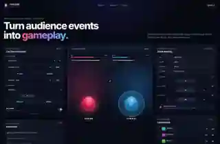
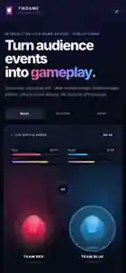

# TikGame Engine Demo

> **Turn LIVE audience events into gameplay.**

TikGame Engine Demo is a small, independent public showcase of one architectural idea:

**EVENT → ENGINE → GAME**

Comments choose teams, likes charge energy, follows activate shields, and simulated gifts trigger attacks inside a polished 9:16 streaming overlay.

> **This project uses simulated LIVE events and does not require or connect to the TikTok API.**

[▶ Open Live Demo](https://remb82-lab.github.io/TikGame-Engine-Demo/)

## Live Demo

Clone the repository and start the showcase with one command flow:

```bash
npm install
npm run dev
```

Then press **Run Live Demo**. A scripted battle demonstrates viewers joining teams, charging energy, triggering shields, launching attacks and reaching a winner state.

## Screenshots

### Desktop



### Mobile



## What it demonstrates

- Strict TypeScript event model for `COMMENT`, `LIKE`, `FOLLOW`, and `GIFT`
- UI-independent event bus, mapping layer and game runtime
- Fully local LIVE Event Simulator with no credentials or backend
- Interactive 9:16 Battle Arena with health, energy, shields, critical hits and winner state
- Real-time leaderboard and event feed
- Creator Studio Lite with instant rule tuning
- Scripted one-click showcase plus manual, auto, burst, pause, resume and reset controls
- Responsive desktop and mobile layouts

## LIVE Battle Arena

Two teams fight on a vertical streaming field. Audience events become game commands:

| Simulated event | Game effect |
| --- | --- |
| `COMMENT red` / `COMMENT blue` | Join a team |
| `LIKE` | Add team energy |
| `FOLLOW` | Activate a temporary shield |
| `GIFT_SMALL` | Attack the opposing team |
| `GIFT_LARGE` | Trigger a power attack |

The demo does not model real gift prices or platform economics.

## Event Simulator

The local simulator supports manual COMMENT / LIKE / FOLLOW / GIFT events, selectable and random test users, Auto Demo, 0.5× / 1× / 2× / 4× event speeds, pause / resume / reset, Burst Mode, and the `Quiet Stream`, `Active Stream`, `Gift Battle`, and `Chaos Mode` scenarios.

## Creator Studio Lite

Creator Studio Lite intentionally demonstrates only a small editable rule surface. It is **not** a public Visual Logic Compiler or production creator suite.

Editable rules:

- LIKE POWER: `1 / 2 / 5`
- GIFT DAMAGE: `5 / 10 / 25`
- ROUND TIME: `30 / 60 / 90 sec`

Changes affect subsequent events immediately.

## Architecture

```text
src/
  app/
  core/
    events/
    game/
    simulator/
  games/
    battle-arena/
  components/
    arena/
    leaderboard/
    event-feed/
    simulator/
    studio/
  data/
  hooks/
  types/
```

Core boundaries:

- `DemoEventBus` — typed event transport
- `EventMapper` — converts LIVE events to game commands
- `GameRuntime` — applies commands and owns game state without React dependencies
- `EventSimulator` — local event source and showcase scenarios
- `BattleArenaGame` — game-specific battle rules and state transitions
- `OverlayRenderer` — projects runtime state into overlay-ready view data
- `BattleArena` — React presentation layer for the overlay

## Event Flow

```text
LIVE EVENT SIMULATOR
        ↓
    EVENT BUS
        ↓
   EVENT MAPPER
        ↓
   GAME RUNTIME
        ↓
    GAME STATE
        ↓
   OVERLAY / UI
```

## Tech Stack

React · TypeScript · Vite · CSS animations · Vitest · GitHub Actions

No backend is required.

## Quick Start

Requirements: Node.js 20+ (CI uses Node.js 22).

```bash
git clone https://github.com/remb82-lab/TikGame-Engine-Demo.git
cd TikGame-Engine-Demo
npm install
npm run dev
```

Quality checks:

```bash
npm run security
npm run typecheck
npm test
npm run build
```

## Security & Privacy

This repository is designed to run without `.env`, credentials or external LIVE integrations. It must not contain TikTok credentials, unofficial LIVE connectors, Supabase credentials, AI provider keys, GitHub tokens, webhook secrets, private production endpoints, private Factory infrastructure, or production code copied from private repositories.

## Scope

This v1 demo intentionally does **not** include Visual Logic Compiler, Economy systems, SDK packaging, real LIVE bridge, or production/private integrations. The goal is a focused demonstration of **EVENT → ENGINE → GAME**.

## Disclaimer

This project is an independent technical demo. It is not affiliated with, endorsed by, or sponsored by TikTok or ByteDance. “TikTok” is a trademark of its respective owner. The application uses simulated LIVE-style events only and does not connect to TikTok APIs.

## Author

**remb82-lab**
